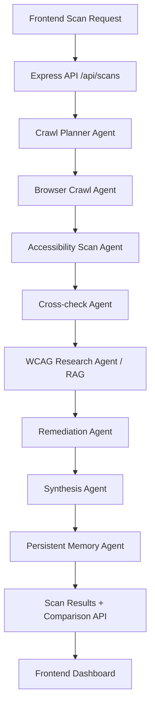

# Accessibility Remediation Copilot for E-commerce and SMB Websites

## Business problem
Small and medium businesses often cannot afford a dedicated accessibility team, yet legal, conversion, and reputation risks increase when WCAG issues persist.

## Why GenAI here
This app uses an agentic pipeline to convert raw accessibility findings into grounded, developer-ready remediation guidance with business context.

## Architecture
- **Frontend**: React + Vite dashboard for scan setup, live progress, findings, and history comparison.
- **Backend**: Express API owns all scan orchestration and persistent scan memory.
- **Memory**: File-backed persistent store (`data/scans.json`) to keep scan history across restarts.
- **RAG**: Local WCAG corpus (official W3C links + chunked summaries) with lexical retrieval per finding.
- **Agents**:
  1. Crawl Planner Agent
  2. Browser Crawl Agent (fetch fallback in constrained env)
  3. Accessibility Scan Agent
  4. Cross-check / Audit Agent
  5. WCAG Research Agent
  6. Visual Evidence Agent (degraded when screenshot runtime unavailable)
  7. Remediation Agent
  8. Synthesis / Reporting Agent
  9. Memory / History Agent



## LangGraph usage note
The backend now attempts real `@langchain/langgraph` orchestration first (dynamic runtime import in `server/pipeline.ts`). If the package is unavailable at runtime, it automatically degrades to the deterministic fallback pipeline so demos still run.

To force full LangGraph mode locally, install:
```bash
npm install @langchain/langgraph @langchain/core langchain
```

Optional hard gate:
```bash
REQUIRE_LANGGRAPH=true npm run dev
```
If LangGraph is missing, the server exits on startup. `/api/health` also reports `langgraphLoaded` and orchestration mode.

## RAG design
- Corpus: WCAG 2.2 Understanding references and criteria chunks.
- Retrieval: lightweight lexical score over chunk tokens (fast + local, no external embedding dependency).
- Output: each finding carries WCAG references and source URLs.

## Responsible AI considerations
- No secrets are required in the browser.
- Remediation output is dry-run/copiable, not auto-write to production storefront.
- Evidence is grounded with WCAG source links.

## Demo script
1. Start backend/frontend.
2. Run scan on a homepage.
3. Watch live agent timeline.
4. Open remediation cards and WCAG evidence links.
5. Run another scan and demonstrate comparison metrics.

## Evaluation artifact
See `docs/evaluation-sample.json`.

## Limitations
- Playwright + true screenshot annotation is runtime-dependent and can degrade in restricted environments.
- Current RAG uses lexical retrieval instead of vector embeddings for reliability and speed.

## Local run
```bash
npm install
npm run dev
```
Open `http://localhost:5000`.
